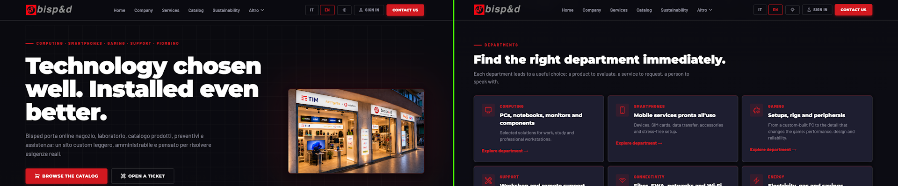

# Bisped.net — WebCMS Light + AI Concierge

> CMS PHP/MariaDB custom per [bisped.net](https://bisped.net) — negozio informatica, telefonia ed energia a Piombino (LI).
> In produzione su `https://bisped.net` (HOST.it). Sostituisce il precedente WordPress/WooCommerce.

---

## Stack e tecnologie


---

## AI Concierge — Professional Agent Swarm

Il componente principale del rework: agenti commerciali specializzati che qualificano i lead in chat con handoff WhatsApp automatico e summary precompilato.

```
Cliente scrive → ConversationSupervisor (invisibile)
                         │
              ┌──────────┼──────────┐
              ▼          ▼          ▼
           SerenAI    AndreAI    SarAI
          TLC/fibra  IT/device  Energia
              │          │          │
              └──────────┴──────────┘
                         │
                 ConversationMemory
                 AgentTurnPlanner
                 BispedBusinessContext
                 ResponseComposer
                         │
                         ▼
              WhatsApp automatico
           con summary precompilato
```

### Agenti specializzati

| Agente | Settore | Cosa qualifica |
|--------|---------|----------------|
| **SerenAI** | TLC — fibra, FWA, mobile, operatori | Operatore attuale, impatto problema, cross-sell |
| **AndreAI** | Informatica — device, PC, upgrade, repair | Brand, modello, budget, acquisto diretto vs operatore |
| **SarAI** | Energia — luce, gas, volture, business | Tipo utenza, costo attuale, opportunità risparmio |

### Esempio — Samsung Z Fold

```
Cliente  →  "vorrei un fold"
AndreAI  →  "Bene, il Galaxy Z Fold parte ~1700€ in acquisto diretto
             ma con operatore si scende parecchio.
             Hai un budget in mente?"
Cliente  →  "ho 1200 euro, con operatore"
AndreAI  →  "Ok, ho tutto. Lasciami un numero."
Cliente  →  "3346582115"
             ↓
WhatsApp si apre automaticamente con:
  Richiesta: Acquisto Samsung Galaxy Z Fold
  Budget: 1200€ | Acquisto: con operatore
  Telefono: 3346582115
```

---

## Architettura

```
bisped.net/
├── app/
│   ├── Controllers/
│   │   ├── AiConciergeController.php
│   │   └── Admin/AiConciergeController.php
│   └── Services/
│       ├── Ai/
│       │   ├── ConversationSupervisor.php    ← cervello principale
│       │   ├── ConversationMemory.php         ← stato live
│       │   ├── AgentSwarmRouter.php           ← routing agente
│       │   ├── AgentTurnPlanner.php           ← prossima mossa
│       │   ├── BispedBusinessContext.php      ← knowledge prodotti/prezzi
│       │   ├── ResponseComposer.php           ← risposta naturale
│       │   ├── HandoffDecisionEngine.php      ← criteri handoff
│       │   ├── CommercialReportBuilder.php    ← report admin
│       │   ├── ResponseStyleGuard.php         ← blocca frasi vietate
│       │   ├── ConversationRepair.php         ← correzioni esplicite
│       │   ├── LeadExtractor.php              ← slot extraction
│       │   └── NeedClassifier.php             ← routing settore
│       └── WhatsApp/
│           └── WhatsAppHandoffBuilder.php     ← summary wa.me
├── public/assets/
│   ├── js/ai-concierge.js     ← UI WhatsApp-like, auto-redirect
│   └── css/ai-concierge.css   ← dark mode WhatsApp styling
├── database/schema.sql
├── docs/
│   ├── AI_CONCIERGE.md
│   └── SECURITY_ASSESSMENT.md
└── scripts/
    └── test-ai-concierge-professional-swarm.php  ← 106 test
```

---

## Funzionalità CMS

- **Pagine pubbliche** — home, azienda, servizi, sostenibilita, contatti, appuntamenti, products, blog, faq, legal + route `/en/*`
- **Admin** — prodotti, blog, media, impostazioni, messaggi, appuntamenti, conversazioni AI con report commerciale, temperatura lead, cross-sell suggeriti
- **Auth** — password locale, Google OAuth, wallet EVM/Solana; ruoli `admin`, `commesso`, `cliente`
- **Agenda** — richieste appuntamento pubbliche + accettazione admin; sync Google Calendar opzionale
- **Catalogo automatico** — import dal fornitore B2B Runner (FTP) con foto locali, descrizioni, disponibilità reale; 11 reparti macro + sotto-categorie; pricing configurabile da dashboard; lazy-load AJAX; cron disponibilità 6h + catalogo 24h
- **PC configurabili** — build ufficio/gaming generate dal catalogo componenti, con selettori pubblici filtrati per socket, DDR, form factor e alimentazione
- **Ingest editoriale** — job giornaliero news/offerte con immagini e deduplica (Gemini Flash)
- **AI Concierge** — swarm 3 agenti, memoria persistente, slot extraction continua, handoff WhatsApp automatico, report commerciale admin

---

## Setup locale

```bash
cp .env.example.php .env.php
# configurare: database, app.url, app.key, gemini.api_key, whatsapp.phone_number
```

```bash
mysql -u bisped_user -p bisped_net < database/schema.sql
runtime/bin/frankenphp php-cli scripts/migrate-ai-concierge.php
```

**MariaDB:**
```bash
runtime/mariadb/bin/mariadbd \
  --basedir=runtime/mariadb --datadir=runtime/mariadb-data \
  --socket=runtime/mariadb.sock --port=3307 \
  --pid-file=runtime/mariadb.pid --skip-networking=0 --bind-address=127.0.0.1
```

**Server (tunnel bisped.net → 127.0.0.1:4000):**
```bash
runtime/bin/frankenphp php-server --root public --listen 127.0.0.1:4000 --access-log
```

---

## Test

```bash
# AI Concierge swarm — 106 test (routing, memory, handoff, summary, frasi vietate)
runtime/bin/frankenphp php-cli scripts/test-ai-concierge-professional-swarm.php

# Natural flow legacy
runtime/bin/frankenphp php-cli scripts/test-ai-concierge-natural-flow.php

# E2E browser
runtime/venv/bin/python runtime/playwright_check.py
```

---

## Sicurezza

- Secrets **solo in `.env.php`** (gitignored) — **non committare mai `.env.php`**
- Numero WhatsApp configurato esclusivamente in `.env.php` → `whatsapp.phone_number`
- CSRF token su tutti gli endpoint POST (concierge + admin)
- Rate limit sessione: 12 req/min per utente
- Prepared statements PDO su tutte le query DB
- Output LLM inserito via `textContent` — nessun rischio XSS
- URL WhatsApp sanificato backend: `preg_replace('/\D+/', '', $number)` + `rawurlencode()`
- `PromptInjectionGuard`: strip_tags + limite 1500 char su ogni messaggio
- `public/install.php` disabilitato di default (richiede `BISPED_ALLOW_WEB_INSTALL=1`)

Revisione completa → [`docs/SECURITY_ASSESSMENT.md`](docs/SECURITY_ASSESSMENT.md)

---

## Note operative

- Non modificare la produzione WordPress via FTP durante lo sviluppo
- Produzione su `https://bisped.net` (HOST.it, deploy FTP via GitHub Actions)
- `runtime/` è esclusa da Git (FrankenPHP, MariaDB, Playwright, venv)
- `BispedBusinessContext.php` contiene stime di prezzo indicative — aggiornare manualmente se cambiano
- Deploy produzione richiede: rotazione `app.key`, credenziali OAuth/SMTP, `app.url=https://bisped.net`

## Cron produzione PC Custom

Su DirectAdmin/HOST.it aggiungere questo cron giornaliero dopo il cron di import prodotti/prezzi Runner. Genera e aggiorna i prodotti `PC-Custom` dal catalogo componenti, usando Gemini per validare le configurazioni commercialmente sensate.

```bash
30 4 * * * /usr/local/php81/bin/php /home/uu4c5pdm/domains/bisped.net/public_html/scripts/auto-update/generate-pc-catalog.php >> /home/uu4c5pdm/domains/bisped.net/public_html/storage/logs/pc-configurator-cron.log 2>&1
```

Il deploy Git aggiorna solo i file: alla prima installazione eseguire anche la migrazione del database. Per una diagnosi non distruttiva della pipeline sul server:

```bash
/usr/local/php81/bin/php /home/uu4c5pdm/domains/bisped.net/public_html/scripts/migrate-pc-configurator.php
/usr/local/php81/bin/php /home/uu4c5pdm/domains/bisped.net/public_html/scripts/diagnose-pc-catalog.php
```

## Analytics e SEO locale

- GA4 e Meta Pixel sono configurabili in `.env.php` dentro `analytics.ga4_measurement_id` e `analytics.meta_pixel_id`; se vuoti non viene caricato nessun tag esterno.
- I tag partono solo dopo consenso cookie `Accetta`, con consenso Google inizializzato a `denied` e Pixel Meta non caricato prima dell'ok.
- Le visite alle schede prodotto alimentano una metrica interna aggregata usata anche dalla vetrina prodotti della pagina servizi.
- I vecchi URL SEO tipo `/negozio/samsung-galaxy` sono serviti come landing dinamiche con prodotti e articoli collegati.
- Gli URL legacy dello shop sotto `/negozio/*` sono rimappati per pattern: prodotto equivalente, landing marca/famiglia o catalogo. Vedi [`docs/LEGACY_SEO_URLS.md`](docs/LEGACY_SEO_URLS.md).

Migrazione produzione per le metriche interne:

```bash
/usr/local/php81/bin/php /home/uu4c5pdm/domains/bisped.net/public_html/scripts/migrate-analytics-seo.php
```

---

## Documentazione

- [`docs/AI_CONCIERGE.md`](docs/AI_CONCIERGE.md) — architettura e API del concierge
- [`docs/PC_CONFIGURATOR.md`](docs/PC_CONFIGURATOR.md) — configuratore PC, vincoli e cron build gaming
- [`docs/SECURITY_ASSESSMENT.md`](docs/SECURITY_ASSESSMENT.md) — security audit completo
- [`docs/BISPED_MIGRATION_AUDIT.md`](docs/BISPED_MIGRATION_AUDIT.md) — audit migrazione da WordPress
- [`docs/DEPLOYMENT.md`](docs/DEPLOYMENT.md) — procedura deploy produzione

---

*Repo privato — Bisp&d s.r.l., Piombino (LI)*
